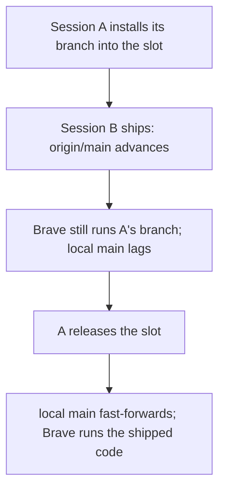
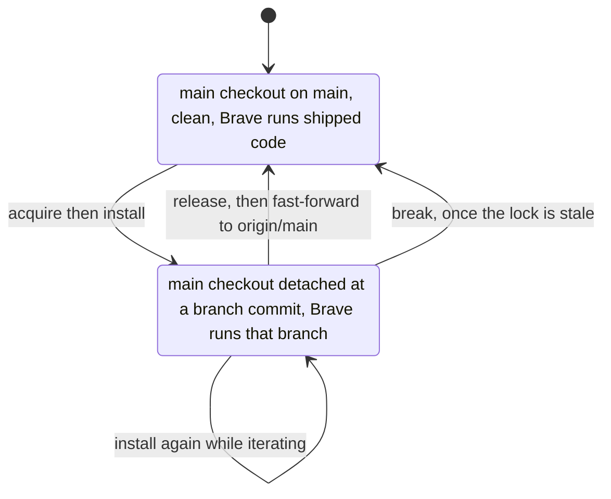

# Local Test and Ship Workflow - Plan

## Goal Capsule

- **Objective:** A change can be tried in the user's own Brave before it lands, and landed on `origin/main` afterwards, while several sessions work in parallel without disturbing each other's tests or each other's ships.
- **Means:** Adopt three mechanisms from the sibling repos — a mutex over the extension folder Brave has loaded, a `ship` procedure, and a one-emoji stage prefix on every session title — with no build step.
- **Product authority:** The repo's solo developer, the only person who can open the popup or press the shortcut in the profile whose extensions the popup exists to list. Requirements win on behavior; KTDs win on mechanism inside them.
- **Execution profile:** One shell script, two skill files, and a section of `AGENTS.md`. No build, no runtime dependency, no test framework.
- **Stop conditions:** Stop if the swap cannot leave the main checkout returnable to the latest `main`, or if the lock cannot be made atomic across worktrees.
- **Finishing:** `ce-work` implements and exercises the script against a scratch repo; the first real round trip in the user's Brave is the acceptance, and `ship` lands it.
- **Open blockers:** None.

---

## Product Contract

### Summary

Three additions: a lock that lets one session at a time put its branch into the Brave the user already has loaded, a `ship` procedure that squashes a branch onto `origin/main` and brings the local `main` that Brave reads along with it, and a stage prefix on every session title. No build step, and nothing inside Compound Engineering changes.

### Problem Frame

Sessions here run in parallel worktrees — eight branches were fast-forwarded onto `main` in the hour before this plan was written. Brave loads one folder, the main checkout, and re-reads the popup from disk every time it opens. Only the user can open that popup or press the shortcut: the headless Brave harness in `AGENTS.md` reaches neither.

So landing and trying are currently the same act. A change reaches the user by being merged into `main`, which means the tool they use daily runs code nobody has exercised, and a session landing its own work has no way to know what somebody else is looking at.

Compound Engineering does not close this. Its shipping tail is shaped around pull requests and CI; this repo has one developer, no CI, and a remote added today only so the work has somewhere to go. Nothing in CE knows that `main` is what the user sees.

### Key Decisions

- **No build step.** (session-settled: user-directed — chosen over @crxjs/vite-plugin with a launchd dev server: the popup goes dead whenever that server is down.) Governs R1, R2.
- **Brave keeps loading the main checkout.** (session-settled: user-directed — chosen over a dedicated live folder: it would cost a second Load unpacked.) Governs R1, R2, R3.
- **Shipping is asked for, never inferred.** (session-settled: user-approved — chosen over letting a finished work session land its own change: only the user can try the popup, and `main` is what they use.) Governs R7.
- **Ship pushes straight to `origin/main`.** (session-settled: user-approved — chosen over opening a pull request: one developer, no CI, and a PR puts nothing in Brave.) Governs R8.
- **One stage prefix per title, from a fixed set of seven.** (session-settled: user-directed — chosen over adding a planning prefix or cutting the set to four: 📚 went with the `learn` skill that CE's ce-compound replaces.) Governs R11, R12.
- **Only committed work reaches the live slot.** Ship squashes afterwards, so the commits a session makes to show its work cost nothing. Governs R2.
- **The procedures live in skills that load when invoked.** The always-loaded instructions grow by a table and two pointers. Governs R14.
- **Compound Engineering is left as installed.** No config, no `learn` skills; ce-compound keeps the learnings job this repo's working agreements just gave it. Governs R14.

### Actors

- A1. The user — opens the popup, presses the shortcut, says when something ships.
- A2. A working session — an agent on its own branch in a worktree under `.claude/worktrees/`.
- A3. The loaded extension — Brave's unpacked copy, pointed at the main checkout, re-read from disk at every popup open.

### Requirements

**The live slot**

- R1. Brave keeps loading the folder it loads today, and nothing in this workflow asks for Load unpacked again.
- R2. One session at a time can put its branch's committed state into that folder, with no action from A1.
- R3. Releasing the slot returns the folder to the latest `main`, including work that shipped while the slot was held.
- R4. A session that finds the slot taken is told which session holds it, leaves the slot alone, and parks; a slot left behind by a dead session can be taken back.
- R5. Installing a branch whose manifest differs from the loaded one ends with that manifest in force rather than silently ignored.
- R6. A session installs as soon as its change is ready to try, without waiting to be asked, whenever the slot is free.

**Shipping**

- R7. `ship` runs only when A1 asks for it; no Compound Engineering workflow lands a change on its own.
- R8. A ship lands the branch as a single commit on `origin/main`, rebasing and retrying when another ship got there first.
- R9. A ship leaves a branch that is in the live slot where it is, and a release never puts shipped work back.
- R10. A ship says when the change is on `origin/main` but not yet in Brave, and the local `main` catches up no later than the next release of the slot.

**Session titles**

- R11. Every session in this repo carries exactly one stage prefix, set when the stage starts and replaced rather than stacked.
- R12. The set is ⏳ working, 🔓 waiting for or releasing the slot, 🔒 holding the slot, 📦 committed and shippable, 🚀 shipping or shipped, 🚙 waiting on the user, 🪦 dead end.
- R13. The lock and `ship` set their own prefixes, and no response mentions a prefix.

**Footprint**

- R14. `AGENTS.md` gains the title table and short pointers only; the lock and ship procedures live in skills, and CE's config and skills are left untouched.

### Key Flows

- F1. Put a branch in front of the user
  - **Trigger:** A2's change is ready to try and committed on its branch.
  - **Actors:** A2, A3, A1
  - **Steps:** The session takes the slot, points the loaded folder at its branch, then hands back saying what to open and what to look for — and whether the card needs a reload first.
  - **Outcome:** A1's next popup runs the branch.
  - **Covers R2, R5, R6.**
- F2. Land a change
  - **Trigger:** A1 asks for it.
  - **Actors:** A2, A1
  - **Steps:** The session squashes its branch to one commit, pushes it to `origin/main`, and on a rejection rebases and retries; the local `main` follows when the slot is free.
  - **Outcome:** The change is on GitHub, and in Brave once the slot is free.
  - **Covers R7, R8, R9, R10.**
- F3. Two sessions want the slot
  - **Trigger:** A2 finds the slot held.
  - **Actors:** A2, A1
  - **Steps:** It names the session that holds it, parks, and leaves the slot alone.
  - **Covers R4, R11.**
- F4. Give the slot back
  - **Trigger:** A1 is done looking, or the branch shipped.
  - **Actors:** A2, A3
  - **Steps:** The folder goes back to the latest `main`, anything shipped meanwhile included, and the lock is dropped.
  - **Covers R3, R9.**

### Acceptance Examples

- AE1. **Covers R4, R11.** **Given** session A holds the slot, **when** session B is ready to try its branch, **then** B names the session that has Brave, parks, and installs nothing.
- AE2. **Covers R9, R10.** **Given** A's branch is in the slot, **when** B ships, **then** `origin/main` advances, Brave keeps running A's branch, and B's report says the change is not in Brave yet.
- AE3. **Covers R3.** **Given** a ship landed while A held the slot, **when** A releases it, **then** the folder holds the latest `main`, not the state it had when A took the slot.
- AE4. **Covers R5.** **Given** a branch changes `manifest.json`, **when** it is installed, **then** the session says the card needs its reload button before the change takes effect.
- AE5. **Covers R7.** **Given** a work session finishes with its branch committed, **when** nobody has asked for a ship, **then** nothing lands on `main` and the session parks as shippable.

### Success Criteria

- The user never clicks Load unpacked again for this repo.
- The sidebar answers "which session has my Brave" and "which are waiting on me" without opening a session.
- `main` keeps one commit per change and stays linear.

### Scope Boundaries

- crxjs, Vite, TypeScript, npm and the launchd dev-service: the extension keeps no build step, so none of them has a job here.
- A wait queue for the slot. A denied session names the holder and parks rather than queueing.
- Testing in a second Brave profile instead of the user's. A scratch profile has none of the extensions the popup exists to list, so what it shows is not the thing under test.
- Pull requests, CI, and the CE skills built around them.
- `learn` and `learn-organize`.
- Landing the branches currently sitting unlanded in the other worktrees.
- The headless Brave harness in `AGENTS.md` is unchanged, and still cannot exercise the popup or the shortcut.

### Dependencies / Assumptions

- Brave re-reads the extension's pages from disk each time they open, and the manifest only on reload (`AGENTS.md:35`), as measured on a probe extension in `docs/solutions/developer-experience/what-an-edit-to-an-unpacked-extension-needs.md`. The whole swap depends on it, and it holds for pages only: a content script or service worker added here later would make every install need the extension reloaded too.
- Brave has the main checkout loaded by absolute path, and a folder loaded from a worktree breaks when that worktree is removed (`AGENTS.md:38-39`).
- `origin` (`github.com/raineorshine/extension-options-palette`) was added today, and `main` tracks it.
- Sessions work in worktrees under `.claude/worktrees/`, on branches the harness creates from `refs/heads/main`.
- With a remote in place, a CE work session would otherwise hand the change to a project shipping process or open a pull request. R7 is stated for that reason rather than assumed.
- A session commits before it installs; ship squashes, so those commits never reach `main` individually.

### Outstanding Questions

**Deferred to Planning**

- How the swap moves files — checking out the branch's commit in the main checkout, or copying its files over — and how either refuses when the main checkout has uncommitted work of its own.
- Whether `ship` runs any check before landing. The repo has `.prettierrc.json` but nothing wired to run prettier, and no test command.
- Whether the local `main` fast-forward belongs to `ship`, to the release, or to both.
- Where the skills live: `.github/skills/` with `.claude/skills` symlinked to it, as the sibling repos do.
- How R5 gets the reload a changed manifest needs: asking A1 for the card's button, or triggering it — `chrome.runtime.reload()` works from the extension's own page with developer mode on, and `chrome.developerPrivate.reload(id)` is what the button itself calls.

### Sources / Research

- `AGENTS.md:35` and `AGENTS.md:38-39` — how Brave reads and remembers the folder. `AGENTS.md:101` and `AGENTS.md:128-129` — the headless harness and what it cannot test. `AGENTS.md:134` — the ce-compound working agreement.
- `~/projects/karabiner/docs/workflow.md` and `~/projects/karabiner/scripts/karabiner-test-lock.sh` — the live-slot lock this one is modelled on: acquire, install, release, status, break, and no queue.
- `~/projects/github-triage/scripts/triage-test-lock.sh` — the same lock with the wait queue this plan leaves out. `~/projects/github-triage/.github/skills/ship/SKILL.md` — "Shipping is asked for, never inferred", and the rebase-and-retry loop.
- `~/projects/github-more-shortcuts/.github/skills/ship/SKILL.md` — the ship this repo starts from, minus its typecheck and dev-server steps.
- `docs/solutions/developer-experience/what-an-edit-to-an-unpacked-extension-needs.md` — which surface picks up an edit when, measured in headless Brave; also the reload API behind the card's button, and that an extension can reload itself once developer mode is on.
- The Compound Engineering plugin's `ce-work/references/shipping-workflow.md` ("Project-defined shipping process wins") and `lfg/references/shipping.md` — how CE decides what happens at the end of a work session.

---

## Planning Contract

Product Contract preservation: unchanged.

### Key Technical Decisions

- KTD1. **The slot is swapped with a detached checkout.** `git checkout --detach <branch-sha>` in the main checkout installs a branch exactly — files it adds, deletes and renames included — and `git checkout main` puts the folder back. Governs R2, R3.
- KTD2. **Release restores to the current `main`, never to a snapshot.** The prior art snapshots the live file and restores those bytes, which can put back a state already behind what shipped during the lock; returning to the branch and fast-forwarding cannot. Governs R3, R9.
- KTD3. **Only committed work is installed, and only into a checkout that is on `main` and clean apart from the lock itself.** Install refuses on uncommitted or untracked changes, which is what makes KTD2's restore safe, but never on the lock directory: that lives inside the checkout, and the ignore rule for it is only present on commits that already carry it. Requiring `main` keeps the restore target unambiguous, since a checkout left detached by `--keep` would otherwise record a detached commit as the state to return to. Governs R2.
- KTD4. **The lock is a `mkdir` on `.claude/extension-test.lock/` in the main checkout**, holding the owning worktree, branch, session id and title, acquire time, the installed sha, and the ref to restore. `mkdir` is the atomic test-and-set; 30 minutes marks it stale. Governs R4.
- KTD5. **Ownership is the worktree path; the session id and title are for the denial.** The id comes from `CLAUDE_CODE_HOST_SESSION_ID`, the title from the host's session-info tool, so a refused session can name the chat that holds Brave. Governs R4.
- KTD6. **Ship pushes `HEAD:main` from the worktree and fast-forwards the local `main` only when the main checkout is on `main` and clean.** A push cannot be blocked by a checkout that is mid-test, and a fast-forward against a detached slot would silently uninstall the branch under test. Governs R8, R9, R10.
- KTD7. **Install compares `manifest.json` across the swap and tells the user to press the card's reload button when it differs.** Everything else is re-read from disk when the popup opens. Governs R5.
- KTD8. **The skills live in `.github/skills/` with `.claude/skills` symlinked to it**, the sibling repos' layout, so both path spellings are one file and non-Claude agents find them too. Governs R14.
- KTD9. **Ship runs no formatter or test.** The repo has a prettier config but nothing wired to run it, and no test command; the gate is a clean rebase and the user's ask.

### High-Level Technical Design

A ship never moves through this machine: it pushes from its own worktree, and only the `OnMain` state fast-forwards to catch up.

### Assumptions

- The harness creates worktree branches from `refs/heads/main`, so a detached main checkout does not change what a new session branches from — confirmed in the branch reflogs.
- `CLAUDE_CODE_HOST_SESSION_ID` is set for sessions in this harness, and the sibling lock reads the same variable.
- Brave has developer mode on, since it has an unpacked extension loaded, and the manifest `key` pins the id across a reload, so the shortcut assignment survives.

### System-Wide Impact

- While a branch is installed, the main checkout is on a detached HEAD. A session or terminal working there sees that state, and a commit made there would land on no branch. `status` names the holder.
- `.gitignore` gains the lock directory, which lives beside the committed `.claude/skills` symlink.

### Risks & Dependencies

- A session that dies holding the slot leaves a branch in the user's Brave. `status` marks the lock stale after 30 minutes and `break` restores the checkout.
- A ship that lands while the slot is held leaves the local `main` behind `origin/main`, so Brave keeps the older code until the release fast-forwards. Ship says so rather than leaving it silent.
- A worktree on an old branch carries an old copy of the script and the skills, so it releases the way its own copy says. Rebasing that branch on `main` is the fix.
- Two sessions installing at once is settled by `mkdir`; two sessions pushing at once is settled by the non-fast-forward rejection and the rebase-and-retry loop. A ship's fast-forward and another session's install can still reach the same working tree at the same time, where git's own refusal to overwrite is what prevents a half-applied state.
- A session that forked from the one holding the slot carries a different session id, so its ship's blind release does nothing and the slot stays held. `status` names the holder and `break` clears it once stale.

### Sequencing

U1 first, since the skills describe what it does. U2 and U3 are independent of each other. U4 lands last, when both skills exist to point at.

---

## Implementation Units

### U1. Live-slot lock script

- **Goal:** One session at a time owns the folder Brave loads, and the slot always returns to the latest `main`.
- **Requirements:** R2, R3, R4, R5; KTD1-KTD5, KTD7.
- **Dependencies:** none.
- **Files:** `scripts/extension-test-lock.sh` (new), `.gitignore` (modify).
- **Approach:**
  1. Resolve `ROOT` as the main worktree (`git worktree list --porcelain | head -1`), overridable with `PALETTE_ROOT` so the whole script can be exercised against a scratch repo; `SELF` is this worktree's toplevel.
  2. `acquire` takes the lock with `mkdir`, writes the holder fields KTD4 names, and refuses when another worktree holds it, printing holder, session, branch and age. A second acquire from the same worktree changes nothing. `.gitignore` gains the lock directory in this unit, since `acquire` is what creates it inside the main checkout.
  3. `install` requires this worktree's lock and a main checkout clean apart from the lock directory (KTD3), detaches it at this branch's `HEAD`, records the installed sha, and prints the reload line when `manifest.json` differs between the outgoing and incoming trees.
  4. `release` refuses when the checkout is no longer at the installed sha, then returns it to `main` and fast-forwards to `origin/main` before removing the lock. `--force` restores anyway, `--keep` drops the lock and leaves the branch installed, and `--if-mine` is a no-op unless this session id holds it, so `ship` can call it blind.
  5. `status` prints unlocked, held here, or held elsewhere, with the holder fields and a stale marker past `PALETTE_LOCK_STALE` (default 1800s). It also names a checkout that is detached with no lock held — the state `--keep` leaves behind.
  6. `break` refuses on a live lock unless the threshold is overridden to zero, then restores and clears exactly as release does. It is also what puts back a checkout left detached with no lock.
- **Patterns to follow:** `~/projects/karabiner/scripts/karabiner-test-lock.sh` for structure, field names, the holder report, staleness and `--if-mine`. Its swap is a file copy and its release restores a snapshot; both become git operations here, per KTD1 and KTD2.
- **Execution note:** exercise it against a scratch repo with `PALETTE_ROOT`, never against the user's checkout, until the script is finished.
- **Test scenarios:**
  - Covers AE1. A second worktree's `acquire` exits non-zero and names the holding session; the lock fields are untouched.
  - Re-acquiring from the holding worktree leaves `acquired` and the recorded ref as they were.
  - `install` without a lock exits non-zero and leaves the checkout on `main`.
  - `install` with an uncommitted change in the main checkout refuses and leaves that change in place.
  - `install` of a branch that adds a file and deletes another leaves exactly the branch's file set in the folder.
  - Covers AE4. `install` prints the reload line when the branch changes `manifest.json`, and stays quiet when it does not.
  - Covers AE3. A commit pushed to `origin/main` while the lock is held is present in the folder after `release`.
  - `release --if-mine` from a different session id leaves the lock in place.
  - `status` reports stale past the threshold; `break` refuses on a live lock and restores on a stale one.
- **Verification:** every scenario above observed in a scratch repo, with the user's own checkout untouched throughout.

### U2. The `test` skill

- **Goal:** A session can put its branch in front of the user and hand back with something specific to try.
- **Requirements:** R2, R4, R5, R6, R11, R13; F1, F3, F4.
- **Dependencies:** U1.
- **Files:** `.github/skills/test/SKILL.md` (new).
- **Approach:**
  1. Check `status` before anything, and install as soon as the change is ready rather than waiting to be asked (R6).
  2. Set the title prefix for waiting on the slot before acquiring, and the one for holding it once held, passing the session's own title to `acquire` for the denial message (KTD5).
  3. Install this branch's committed head, then hand back naming what to open and what to look for — and the reload click when the manifest changed.
  4. Iterate by committing and re-installing without releasing; release when the user is done or the branch ships.
  5. On a denial, name the holding session, park, and leave the slot alone. Break a lock only after the user confirms it is abandoned.
  6. When `install` refuses — an uncommitted change in the main checkout, or a checkout left detached — release the slot rather than sit on it holding nothing.
- **Patterns to follow:** `~/projects/karabiner/.github/skills/test/SKILL.md` for the division of labor, the hazards list and the stale-lock rules.
- **Test scenarios:** none — a procedure document; the first real round trip is its proof, per the Verification Contract.
- **Verification:** a session follows it end to end on a live branch and the user sees that branch in the popup.

### U3. The `ship` skill

- **Goal:** Land a finished branch on `origin/main` as one commit, and get it into Brave when the slot is free.
- **Requirements:** R7, R8, R9, R10, R11, R13; F2.
- **Dependencies:** U1.
- **Files:** `.github/skills/ship/SKILL.md` (new).
- **Approach:**
  1. Open with the rule that shipping is asked for and never inferred, so a work session that ends here stops instead of landing (R7).
  2. Set the shipping title prefix, then `release --if-mine`.
  3. Rebase on `origin/main`, squash to one commit with an imperative sentence-case subject matching the history, push `HEAD:main`, and on rejection rebase and retry.
  4. Fast-forward the local `main` only from a clean main checkout that is on `main`; otherwise report that Brave keeps the older code until the slot is released (KTD6).
  5. Put the title back when the push did not land.
  6. No learnings step — `AGENTS.md`'s working agreement already runs `ce-compound` at the completion checkpoint.
- **Patterns to follow:** `~/projects/karabiner/.github/skills/ship/SKILL.md` for the step order and the fast-forward-if-it-can step; `~/projects/github-triage/.github/skills/ship/SKILL.md` for the asked-for-never-inferred opening; this repo's history for commit style (imperative, sentence case, no `type:` prefix).
- **Test scenarios:** none — a procedure document; the first real ship is its proof.
- **Verification:** one commit lands on `origin/main` while another branch is installed, and the local `main` catches up when that branch is released.

### U4. Agent instructions and skill plumbing

- **Goal:** Every session finds the workflow without the always-loaded instructions growing much.
- **Requirements:** R7, R11, R12, R13, R14.
- **Dependencies:** U2, U3.
- **Files:** `AGENTS.md` (modify), `.claude/skills` (new symlink to `../.github/skills`).
- **Approach:**
  1. Add a Workflow section naming `test` and `ship`, stating that work happens on a branch in a worktree and that shipping is asked for, never inferred. That last line belongs in the always-loaded file rather than in the skill: a work session reads it there and would otherwise hand the change off without being asked (R7).
  2. Add a Session titles section: the seven-prefix table from R12, one prefix at a time, set when the stage starts, never mentioned in a response, and ask the host which session this is before renaming, because a fork carries the id it read earlier.
  3. Symlink `.claude/skills` to `../.github/skills`. The lock directory is ignored in U1, where it is created.
- **Patterns to follow:** `~/projects/karabiner/docs/workflow.md` and `~/projects/github-triage/AGENTS.md` for the titles section, trimmed to this repo's stages.
- **Test scenarios:** none — instructions.
- **Verification:** a fresh session reads `AGENTS.md` and finds both skills, and `git status` in the main checkout stays clean while a lock is held.

---

## Verification Contract

| Check | How | Applies to |
| --- | --- | --- |
| Shell syntax | `sh -n scripts/extension-test-lock.sh` | U1 |
| Lock behavior | The U1 scenarios, against a scratch repo with `PALETTE_ROOT` set | U1 |
| Real round trip | A session installs its branch, the user opens the popup and sees it, the session releases and the folder returns to `main` | U1, U2 |
| Real ship | A branch lands on `origin/main` as one commit, and the local `main` follows once the slot is free | U1, U3 |
| Instructions | A session that has read only `AGENTS.md` can name both skills and set the right prefix | U4 |

There is no test runner, linter or formatter in this repo: prettier is configured but not installed, and there is no `package.json` to run it from. The checks above are the whole gate.

---

## Definition of Done

- The four units have landed, and `.claude/skills` resolves to `.github/skills`.
- Every U1 scenario has been observed in a scratch repo, and no experimental copy of the script or a stray lock directory is left in the working tree.
- One branch has been installed in the user's Brave, tried by the user, and released, with the folder back on the latest `main` afterwards.
- One change has shipped through `ship`, leaving `main` linear at one commit per change.
- `AGENTS.md` carries the title table and the two pointers, and nothing in `.compound-engineering/` or the CE skills has been modified.
